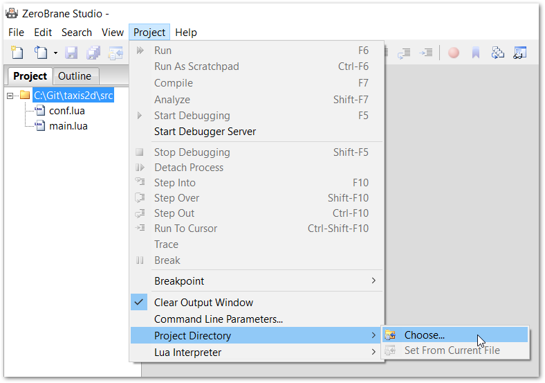

# taxis2d

## Быстрый старт (Windows)
* Скачать и установить [LÖVE 0.10.1](https://bitbucket.org/rude/love/downloads/)
* Добавить путь к папке LÖVE в переменную среды `PATH`
* Скачать [love-imgui](https://github.com/slages/love-imgui/releases)
* Скопировать `imgui.dll` (из архива love-imgui) в папку LÖVE
* Скачать и установить [ZeroBrane Studio](https://studio.zerobrane.com/download?not-this-time)
* `git clone https://github.com/tsukanov-as/taxis2d.git`
* Запустить ZeroBrane Studio и выбрать папку проекта <...>\taxis2d\src

* Открыть файл `main.lua` и нажать `F6`